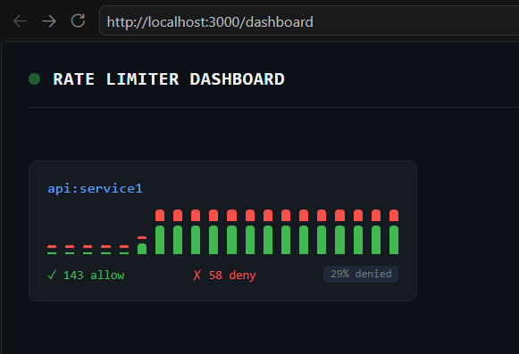

# Token Bucket Rate Limiter Service

A standalone networked rate-limiting API. Other services call `/check` to get `ALLOW` or `DENY` decisions backed by Redis atomic Lua scripts — no double-spending, no race conditions.

---

## Quick Start

### 1. Start Redis

```bash
docker run -d -p 6379:6379 redis:7-alpine
```

### 2. Install & run

```bash
npm install
cp .env.example .env      # edit ADMIN_SECRET and REDIS_* as needed
npm start
```

Service boots at `http://localhost:3000`

---

## API Reference

### `POST /check` — Rate-limit a request

```bash
curl -X POST http://localhost:3000/check \
  -H 'Content-Type: application/json' \
  -d '{"client_key": "user:42"}'
```

**200 ALLOW:**
```json
{ "status": "ALLOW", "remaining": 59, "limit": 60, "reset": 1719000060, "algorithm": "token_bucket" }
```

**429 DENY:**
```json
{ "status": "DENY", "remaining": 0, "limit": 60, "reset": 1719000061, "message": "Rate limit exceeded" }
```

**Response headers on every response:**
```
X-RateLimit-Limit:     60
X-RateLimit-Remaining: 23
X-RateLimit-Reset:     1719000060   (Unix timestamp)
X-RateLimit-Algorithm: token_bucket
Retry-After:           1719000060   (only on 429)
```

---

### `POST /admin/clients` — Configure a client

```bash
curl -X POST http://localhost:3000/admin/clients \
  -H 'Content-Type: application/json' \
  -H 'x-admin-secret: changeme' \
  -d '{
    "client_key":  "user:42",
    "algorithm":   "token_bucket",
    "capacity":    100,
    "refill_rate": 10
  }'
```

| Field         | Algorithm       | Meaning                          | Default |
|---------------|-----------------|----------------------------------|---------|
| `algorithm`   | both            | `token_bucket` or `sliding_window` | `token_bucket` |
| `capacity`    | token_bucket    | max burst size (tokens)          | 100     |
| `refill_rate` | token_bucket    | tokens added per second          | 10      |
| `window_ms`   | sliding_window  | window size in milliseconds      | 1000    |
| `limit_count` | sliding_window  | max requests per window          | 100     |

**Sliding window example:**
```json
{
  "client_key":  "api:partner",
  "algorithm":   "sliding_window",
  "window_ms":   60000,
  "limit_count": 300
}
```

### `GET /admin/clients` — List all clients
### `GET /admin/clients/:key` — Get one client config
### `DELETE /admin/clients/:key` — Remove client + clear Redis bucket

All admin routes require `x-admin-secret` header.

---

### `GET /dashboard` — Live dashboard

Open `http://localhost:3000/dashboard` in a browser. Shows per-client allow/deny rates with sparklines, auto-refreshes every 3s.

Example - 


### `GET /stats` — Raw stats JSON (used by dashboard)

### `GET /health` — Health check

---

## Algorithms

### Token Bucket
- Clients start with a full bucket of `capacity` tokens.
- Each request consumes 1 token. Denied if bucket is empty.
- Bucket refills at `refill_rate` tokens/sec, never exceeding `capacity`.
- Handles burst traffic gracefully.

### Sliding Window
- Counts requests in a rolling window of `window_ms` milliseconds.
- Denied once `limit_count` requests are recorded in the window.
- More predictable than fixed windows (no boundary burst).

Both are implemented as **atomic Redis Lua scripts** loaded via `SCRIPT LOAD` and run with `EVALSHA` — the entire read-modify-write is a single Redis operation, making them fully race-condition safe under any concurrency.

---

## Load Test

Start the server first, then:

```bash
npm run load-test
```

Fires 500+ RPS for 10 seconds and verifies:
- Actual allowed count ≤ theoretical maximum (no double-spending)
- Rate limiting is actively denying requests

---

## Architecture

```
Client Services
     │
     ▼
POST /check  ─────────────────────────────────────────┐
                                                       │
src/limiter.js                                         │
  ├── getClientConfig()  → Redis HGETALL cfg:{key}     │
  └── EVALSHA lua_sha                                  │
        ├── token_bucket.lua   (HMGET/HMSET atomically)│
        └── sliding_window.lua (ZADD/ZCARD atomically) │
                                                       │
Redis ◄────────────────────────────────────────────────┘
  tb:{key}    → { tokens, last_refill_ms }
  sw:{key}    → sorted set of timestamps
  cfg:{key}   → { algorithm, capacity, ... }
  stats:*     → HINCRBY counters (allow/deny per minute)

SQLite (./data/ratelimiter.db)
  clients table → loaded into Redis on startup, updated on admin calls
```

---

## Distributed Mode

To run multiple instances sharing state correctly:

1. All instances must point to the **same Redis** — the Lua scripts guarantee atomicity across instances since Redis is single-threaded.
2. For high availability: use **Redis Cluster** or **Redis Sentinel**.
3. Config (SQLite) can be replaced with any shared DB (Postgres works well) — just update `src/db/config_store.js`.

The core check path makes exactly **2 Redis calls** (HGETALL cfg + EVALSHA) — both are atomic and stateless from the app server's perspective.

---

## Production Checklist

- Set `ADMIN_SECRET` to a strong random value
- Put `/admin/*` behind a VPN or internal network
- Use Redis AUTH (`REDIS_PASSWORD`)
- Set Redis `maxmemory-policy allkeys-lru` to prevent OOM
- Add TLS termination (nginx/caddy in front)
- Monitor `redis_connected_clients` and `redis_used_memory`